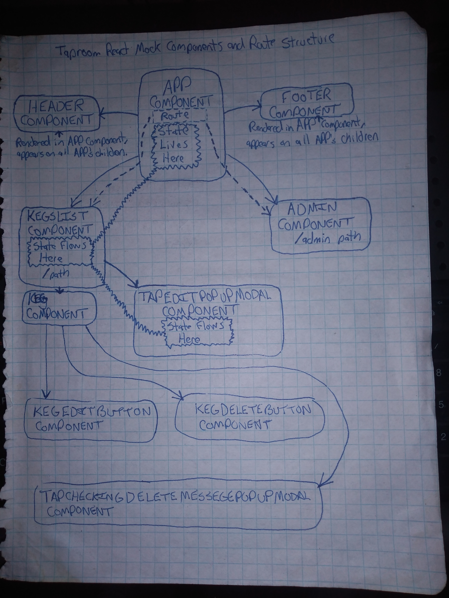

# Taproom React Mock

#### Epicodus Friday React Project, 11/9/2018

#### By _Hassan Al-khalifah_

## Description

The website is a React redo mockup of an Angular tap room project worked on in my Angular course here at [Epicodus](https://www.epicodus.com/). The website essentially will show customers a list/menu of all available kegs for the fictional tap room bar. This will include the name, brand, price and how many pints are available for each offered keg. Beers will also be organized and color coded based on prices and strength.

Listed kegs with 10 pints or less will be marked so the employee can be alerted with it needs to be changed. Each keg has a edit button to open up a pop-up modal. This pop-up modal will allow the employee to edit the keg. There is also a admin console to allow emploee to add a new keg.

The website is broken down into multiple components which have their data types and shapes defined by propTypes. Client-side routing will be used to create the appearance of multiple pages as the user navigated to a different "page". CSS object and JSX style tags are used to provide styles to individual components.

My components structure can be viewed below:



## Website Screenshots

### Landing Page Top

___
### Landing Page Middle

___
### Landing Page Bottom

___
### Admin Page


## My Notes

* Had trouble setting up and working with style-jsx. Seems to have been a version error. Also, it seems you cannot target a tag provide by the Link tags. Using CSS incline styles seems to be the only get around.
* Tried injecting base64 converted imaged into json, but won't work. For the time being, I used image url paths for the image src value. I kept the saved images, as we should be learning more about how to work with base64 converted images soon and using firebase as a way to store and retrieve them.

## User Stories

* As a patron, I want to see a list/menu of all available kegs. For each keg, I need to see its name, brand, price and alcoholContent.
* As a patron, I want to have kegs prices to be color-coded for easy readability.
* As a patron, I want to use the alcohol content property to display stronger beers differently than weaker beers.
* As a patron and/or employee, I want to see how many pints are left in a keg.
* As an employee, I want to be able to see kegs with less than 10 pints left so I can be ready to change them.
* As an employee, I want to fill out a form when I tap a new keg to add it to the list.
* As an employee, I want the option to edit a keg's properties after entering them just in case I make a mistake of to increase/decrease pints left.

## Website Sketch


## Setup Instructions

* Open terminal
* Make sure your in the Desktop directory
```
~ $ cd desktop
```
* Clone the repo
```
~/Desktop $ git clone [REPO URL]
```
* Navigate into main directory of cloned REPO
```
~/Desktop $ cd directory-name
```
* If you are using a mac, consider changing linebreak-style from "windows" to "unix" in the .eslintrc.json file
* Run npm install in terminal to install all required dependencies
```
~/Desktop/directory-name $ npm install
```
* Make sure your atom react package is version 0.17.0. If not, install it
```
~/Desktop/directory-name $ apm install react@0.17.0
```
* Be sure to have the following dependencies installed globally:
```
~/Desktop/directory-name $ webpack@3.4.0 -g
~/Desktop/directory-name $ webpack-dev-server@2.5.0 -g
~/Desktop/directory-name $ eslint@4.13.1 -g
~/Desktop/directory-name $ eslint-plugin-react@7.10.0 -g
```
* Run npm run start in terminal to run server, which will be viewed at http://localhost:8080
```
~/Desktop/directory-name $ npm run start
```

## Technologies Used

* HTML
* JavaScript
* Node.js
* CSS
* Babel
* Webpack
* ESLint

## License

This software is licensed under the MIT license.

Copyright (c) 2018 **Hassan Al-khalifah**
